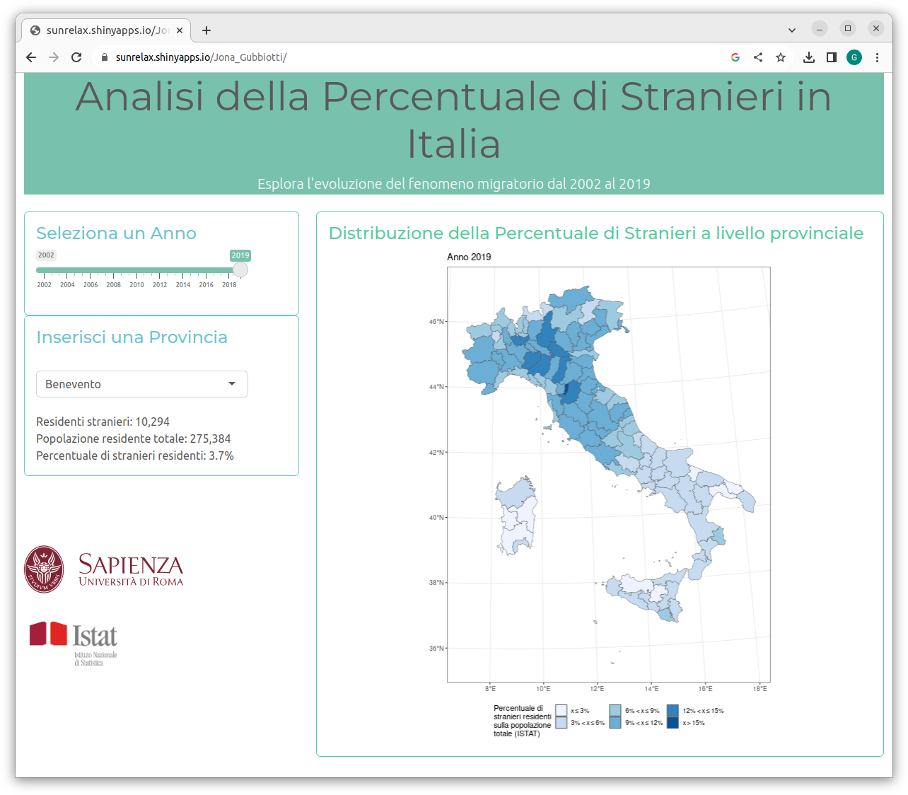

### Descrizione del fenomeno oggetto di analisi

Il gruppo di lavoro composto da Giuseppe Cinque, Stefano Di Virgilio, Paolo Mazza e Giorgia Tagliaferri ha analizzato i dati presenti nella sezione “Popolazione e famiglie” sul sito dell’Istituto nazionale di Statistica (ISTAT), approfondendo in particolare la presenza dei cittadini stranieri residenti regolarmente rilevati in Italia. Lo studio si è concentrato sull’evoluzione del fenomeno dal 2002 al 2019 a livello provinciale.

Per evidenziare la diffusione del fenomeno nella serie temporale di riferimento sono state utilizzate delle mappe territoriali, indispensabili avendo a disposizione dati di natura spaziale.
L’indicatore preso in esame è la percentuale di stranieri rispetto al totale della popolazione residente. Per una migliore rappresentazione e interpretazione dei risultati, tale indicatore è stato suddiviso in classi. 

L'applicazione sviluppata mostra come la percentuale di stranieri aumenti con il passare degli anni, inizialmente al Centro-Nord e successiamente anche al Sud.

### Descrizione dell'applicazione

Quando l'utente apre per la prima volta l'applicazione, sotto il titolo viene visualizzata la mappa territoriale della percentuale di stranieri sul totale dei residenti relativamente all'anno 2002, primo anno oggetto di rilevazione. I colori presenti sulla mappa rappresentano "l'intensità" dell'indicatore, ovvero colori più scuri rappresentano percentuali più elevate. Per poter essere rappresentato in questo modo, l'indicatore è stato preliminarmente suddiviso in intervalli, in modo che ogni intervallo potesse essere rappresentato da un diverso colore. Sotto la mappa è presente una legenda che associa ad ogni colore presente nel grafico l'intervallo rappresentato.

A fianco del grafico, sulla sinistra, l'utente ha a disposizione un cursore tramite il quale può scegliere l'anno di analisi del fenomeno. Gli anni che l'utente può scegliere vanno dal 2002 al 2019. La mappa territoriale si aggiorna automaticamente nell'istante in cui l'utente seleziona un anno diverso.

Sotto il cursore che permette all'utente di scegliere l'anno, è presente un menù a tendina che consente di selezionare una provincia. L'applicazione permette anche all'utente di inserire la provincia manualmente ed è presente una funzionalità di completamento automatico. Una volta che l'utente ha compiuto la propria scelta, in basso può visualizzare il numero di stranieri residenti, la popolazione residente totale e la percentuale di stranieri in quella provincia nell'anno selezionato tramite il cursore. Questi dati si aggiornano automaticamente nell'istante in cui l'utente seleziona un anno diverso.

A completare l'app, sotto il menù a tendina, sono presenti il logo dell'Istat e dell'Università "La Sapienza".

L'applicazione è visualizzabile anche tramite cellulare, tuttavia in questo caso la posizione dei vari elementi dell'interfaccia potrebbe essere diversa rispetto a quella descritta in questo documento.

Sotto è riportato uno screenshoot dell'applicazione raggiungibile al seguente link:

[https://sunrelax.shinyapps.io/Jona_Gubbiotti/](https://sunrelax.shinyapps.io/Jona_Gubbiotti/)

### Riferimenti e sorgenti

